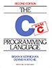

## Notes
These are solutions to programming problems and exercises from various sources;  
the Linked-List-Arithmetic idea is self-assigned; an idea which occurred to me while working through the linked list chapter of *Think Like a Programmer*.

## Linked List Arithmetic 
## [Linked List Arithmetic](Linked-List-Arithmetic/README.md)

This is a self-assigned project, inspired by some of the problems in _**Think Like a Programmer**_.  
The idea was to use linked lists in `C++` to represent numbers, with each node of the list storing a single digit.  
This way arbitrarily large integers can be represented, with a new node added to the list to store each decimal digit. Number magnitude is therefore limited only by RAM storage, not by processor word size.  

  * This basic solution merely represents the numbers with no useful operations other than printing them to the screen
    * [linked list integers v1](Linked-List-Arithmetic/Double-Linked-List-Numbers/TLAP_double_linked_list_numbers.cpp) (doubly linked list solution) -- **C++**
  * Once I decided to implement addition and subtraction I realised I only needed to traverse the list in one direction, so the list node definition is singly linked from here.
    * [linked list integers v2 (with arithmetic operations)](Linked-List-Arithmetic/Linked-List-Numbers/TLAP_linked_list_numbers.cpp) -- **C++**
    * [linked list signed integers (with arithmetic operations)](Linked-List-Arithmetic/Linked-List-Numbers-Signed) -- **C++**