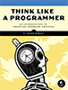
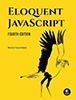

# Algorithms, data structures and programming challenges

## Description

A repository of my solutions to various programming problems, exercises and challenges from various sources, among others:  

* [LeetCode](https://leetcode.com/)
* [The C Programming Language (aka K&R)](https://en.wikipedia.org/wiki/The_C_Programming_Language)  
* [Think Like a Programmer](https://nostarch.com/thinklikeaprogrammer)  
* [Eloquent JavaScript](https://eloquentjavascript.net/)
---

## Directory structure

The [Contents](DIRECTORY.md) page lists the files and folders with a brief description of each category and which language I used to solve a particular problem; the category names are fairly self-explanatory anyway.  

## Running the code

* For **C/C++** files simply compile with `gcc` and run the resulting `a.out` or `a.exe` file.  
* For C# files, use `dotnet script file.cs` instead of _csc file.cs_; csc invokes an older version of the interpreter which doesn't execute modern C# syntax.  
* For JavaScript files, you'll need Node.js; invoke a script with `node script.js`

## Notes
These are solutions to programming problems and exercises from various sources;  
the Linked-List-Arithmetic idea is self-assigned; an idea which occurred to me while working through the linked list chapter of *Think Like a Programmer*.

