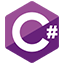

# Algorithms, data structures and programming challenges

<!-- 

 -->

## Description

A repository of my solutions to various programming problems, exercises and challenges from various sources, among others:  
<!-- Front matter -->
A repository of my solutions to various programming problems, exercises and challenges from various sources, among others:  
* [LeetCode](https://leetcode.com/)
* [The C Programming Language (aka K&R)](https://en.wikipedia.org/wiki/The_C_Programming_Language)  
* [Think Like a Programmer](https://nostarch.com/thinklikeaprogrammer)  
* [Eloquent JavaScript](https://eloquentjavascript.net/)

<!--

-->

---

[Contents](DIRECTORY.md)

